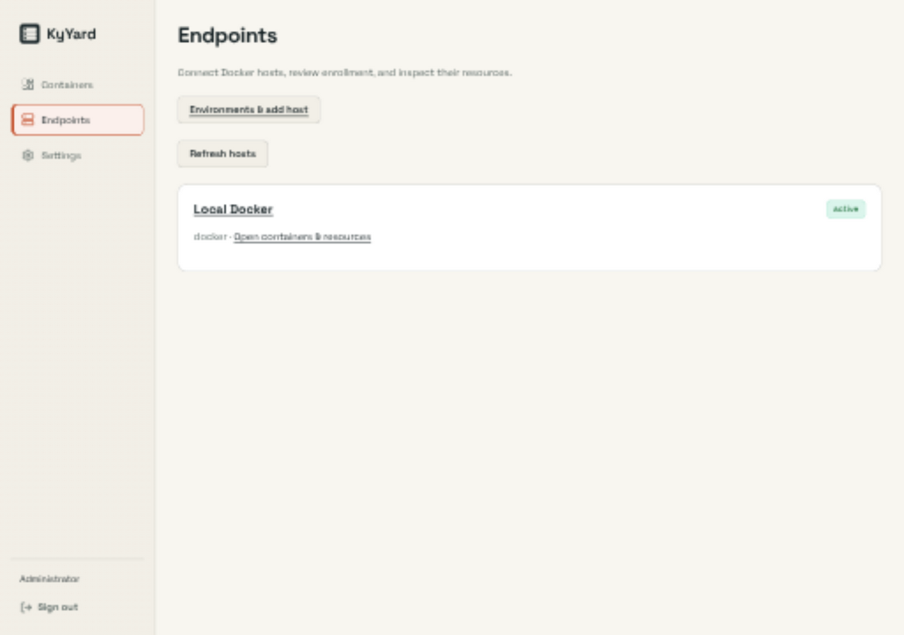
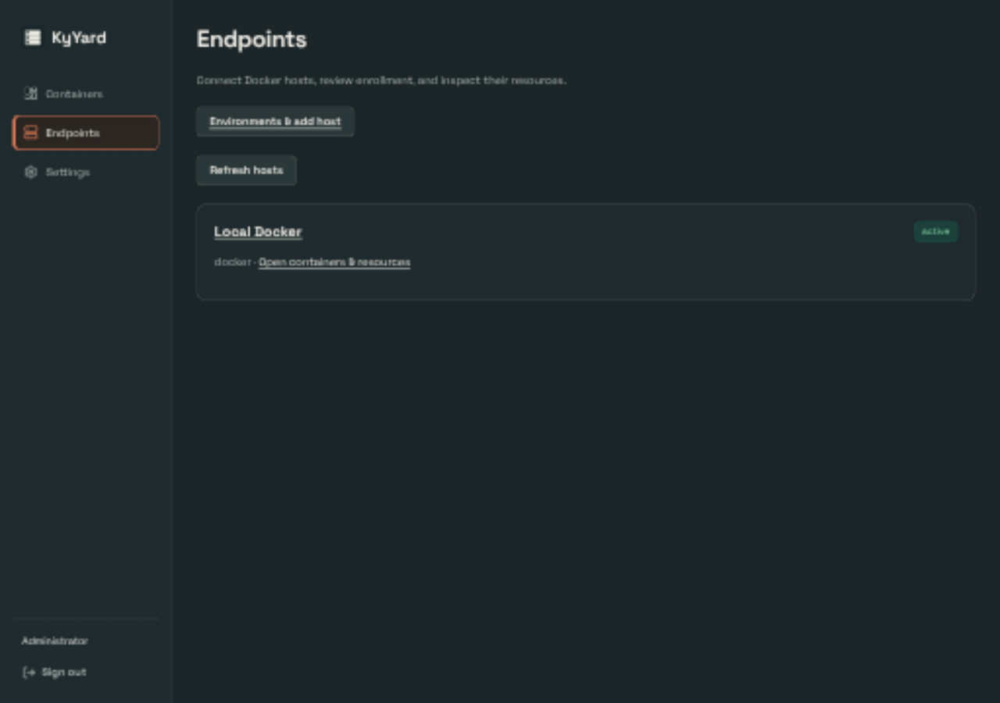
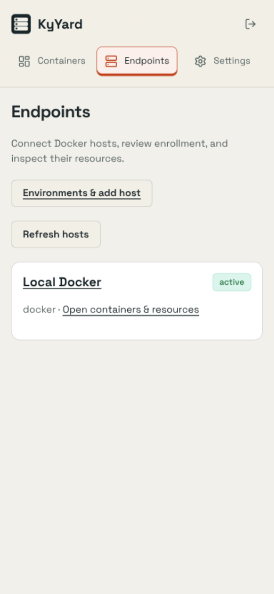
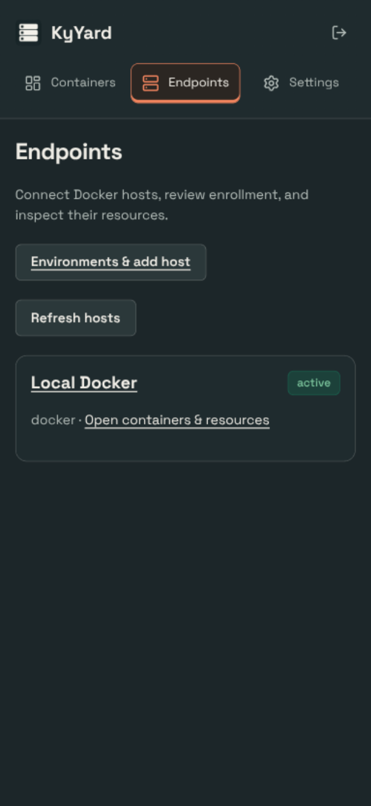

# Shared UI verification

## Change

Use shared Busnes colors and actual navigation states; remove an unused legacy shell block. Shared assets are pinned to ky-ui 0.2.0 with content hashes. Product layouts, saved theme keys and named presets remain local.

## Capture conditions

Captured 2026-09-25 from this branch, using the application UI (not a design mockup). Endpoints page in a real scratch server. Local Docker is discovered; no containers were changed and no deployment actions were performed.

OS-following Busnes Light and Dark were captured at 1280×900 and 390×844 CSS pixels. Browser device scaling may make PNG dimensions larger. Document width stayed within the viewport in these captured states; local navigation/table scrolling is intentional. Screenshots show the selected-page accent, not a complete accessibility audit.

No complete end-to-end product workflow or exhaustive named-theme audit is claimed.

## Checks

227 frontend tests and production build passed. One concurrent test run flaked; an isolated rerun passed all tests. Central ky-ui sync --check verified all ten consumers. Screenshot coverage is Busnes Light/Dark; existing named choices are retained, but not every named palette/page combination was visually exercised.

## Screenshots

| Light | Dark |
| --- | --- |
|  |  |
|  |  |

## Reproduce

Run npm ci, npm test (where configured), and npm run build in web/, then start the product with isolated local preview data following its README. Use System theme, emulate OS light/dark, and inspect both viewport sizes. Do not point preview instances at production data. For KyVault, use a configured development KyIdentity or explicitly labeled read-only browser fixtures; never bypass backend authentication.
