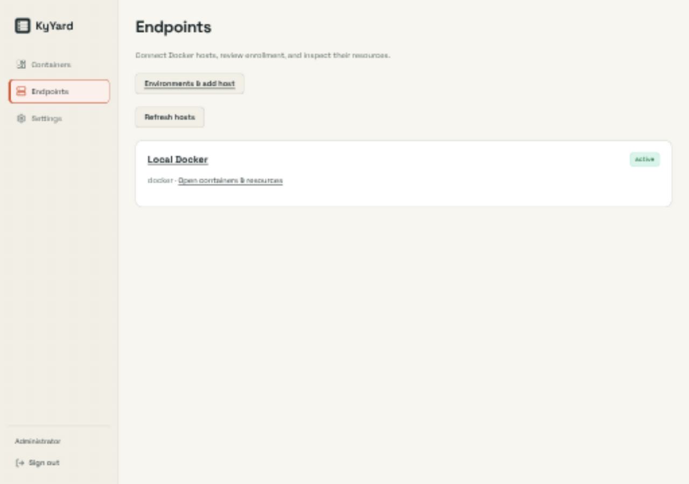
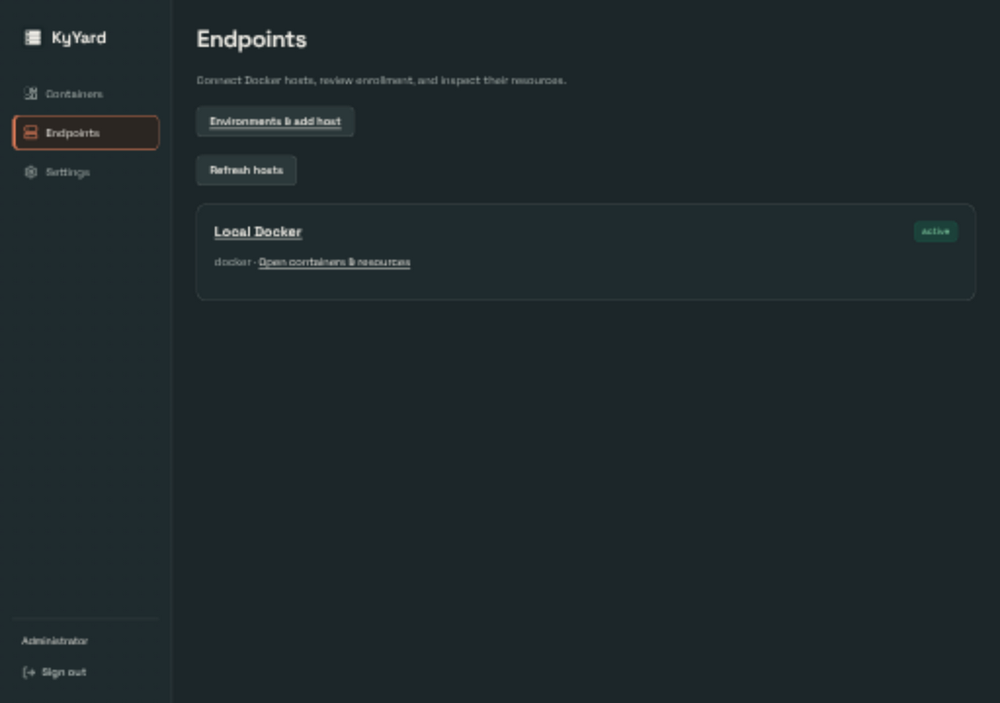
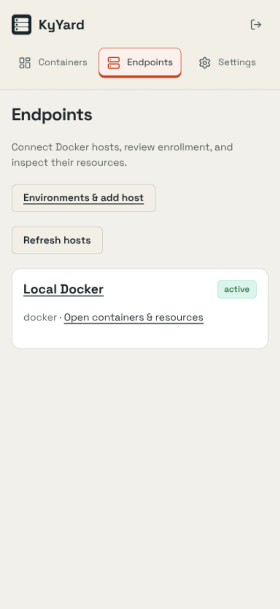
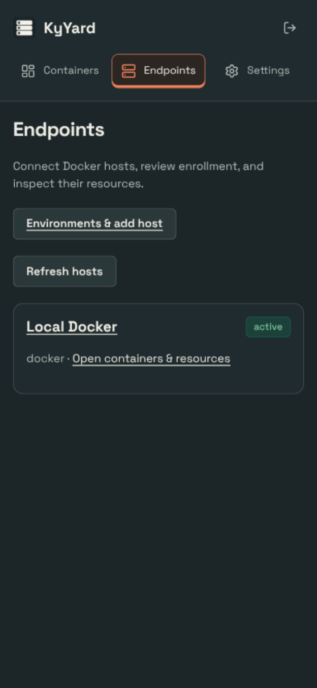
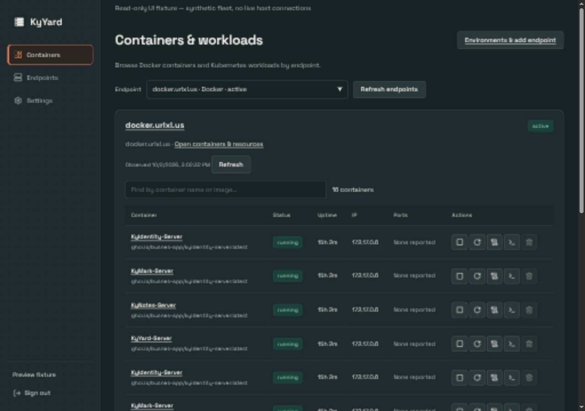
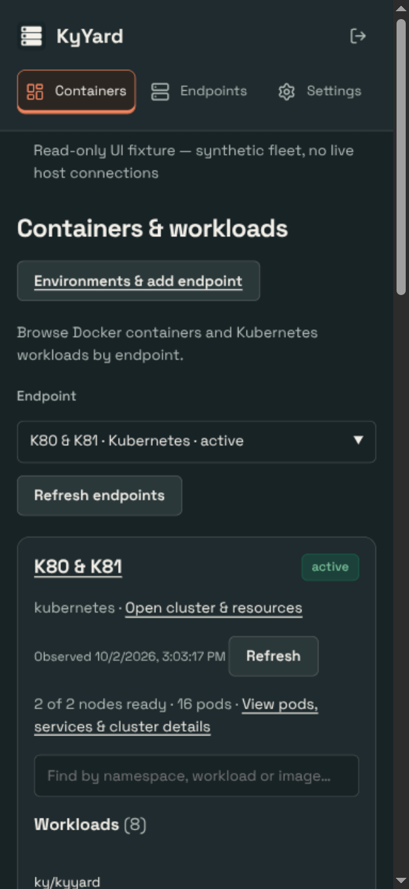

# Shared UI verification

## Change

Use shared Busnes colors and actual navigation states; remove an unused legacy shell block. Shared assets are pinned to ky-ui 0.2.0 with content hashes. Product layouts, saved theme keys and named presets remain local.

## Capture conditions

Captured 2026-09-25 from this branch, using the application UI (not a design mockup). Endpoints page in a real scratch server. Local Docker is discovered; no containers were changed and no deployment actions were performed.

OS-following Busnes Light and Dark were captured at 1280×900 and 390×844 CSS pixels. Browser device scaling may make PNG dimensions larger. Document width stayed within the viewport in these captured states; local navigation/table scrolling is intentional. Screenshots show the selected-page accent, not a complete accessibility audit.

No complete end-to-end product workflow or exhaustive named-theme audit is claimed.

## Checks

227 frontend tests and production build passed. One concurrent test run flaked; an isolated rerun passed all tests. Central ky-ui sync --check verified all ten consumers. Screenshot coverage is Busnes Light/Dark; existing named choices are retained, but not every named palette/page combination was visually exercised.

## Screenshots

| Light | Dark |
| --- | --- |
|  |  |
|  |  |

## Reproduce

Run npm ci, npm test (where configured), and npm run build in web/, then start the product with isolated local preview data following its README. Use System theme, emulate OS light/dark, and inspect both viewport sizes. Do not point preview instances at production data. For KyVault, use a configured development KyIdentity or explicitly labeled read-only browser fixtures; never bypass backend authentication.

## Mixed fleet home, 2026-10-02

The home page selects endpoints by runtime, prefers an active endpoint, and displays Kubernetes workloads instead of the Docker empty state. Offline inventory is collapsed and labelled historical; stale Docker reports disable lifecycle buttons and omit advancing uptime. Endpoint and inventory reads poll every 30 seconds while visible and stop on denial.

Verified the real Dashboard and AppHeader components in an explicitly labelled read-only browser fixture with synthetic Docker and Kubernetes reports. This is layout evidence, not a live cluster or runtime acceptance test. No production credentials or workload mutations were used. At 1280×900 and 390×844, document scroll width stayed within viewport width. At desktop width, the five Docker actions shared one row; the endpoint picker measured 440 CSS pixels. At mobile width, actions remained reachable and tables rendered labelled rows.

483 frontend tests passed, including mixed-runtime switching, historical/stale state, bounded workload search and polling/denial regressions. Typecheck, vendor verification and production build passed; the existing bundle-size warning remains. The root DOX contract and child index were left unchanged because this change stays within frontend ownership; web/AGENTS.md records the behavior.

## Explicit account SSO linking, 2026-10-03

Settings → Sign-in now contains the local-account connection form, with a provider choice and current-password field. The success redirect opens this section. Provider administration remains platform-admin-only. Long callback URLs wrap on mobile.

The committed production bundle was viewed at 1280×800 and 390×844 using synthetic authenticated/provider responses on loopback. Controls fit both viewports; the mobile document fits without horizontal overflow. These are layout fixtures, not live identity or authorization evidence. Frontend tests cover CSRF and clearing the password input; real HTTP/store regressions cover the two identities, original session, changed password, consumed state and future SSO sign-in on the original account. Production callback registration is corrected, but account linking awaits deployment and an operator run. Evidence: [fixture details](docs/ui-verification/2026-10-03-sso-link/README.md).

## Direct container image update, 2026-10-03

The production bundle was exercised against an isolated loopback KyYard server with its built-in Docker agent, a configured public Docker Hub registry and a disposable Alpine container. One browser click on Update image stayed on the endpoint page, showed submission/waiting progress, then completed pull and recreation with all steps succeeded and a replacement link. Docker inspection confirmed a new ID, the old container removed, and the original environment and label retained. The fixture was removed afterward. No production container was changed.

DOM checks at 1280×800 and 390×844 found no document horizontal overflow; the update control and result remained reachable. This is bounded layout and workflow evidence, not an exhaustive accessibility or theme audit. All 495 frontend tests, vendor verification, typecheck and production build passed. Tests also cover the Configuration action excluding unsaved edits, fixed ownership/incomplete-read refusals, duplicate submission protection, results surviving filters and replacement, and lost-response locking across row unmounts. web/AGENTS.md owns the changed action contract; parent docs and child indexes are unchanged because frontend ownership and structure are unchanged.
